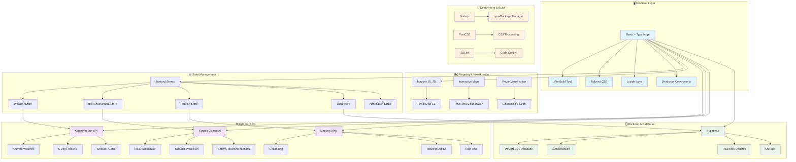

# 🛠️ Tech Stack - AI-Powered Disaster Management System

## 📋 Overview

This document outlines the complete technology stack used in building the AI-powered disaster management system with smart routing capabilities.

---

## 🎯 System Architecture



---

## 🎨 Frontend Technologies

### **Core Framework**
| Technology | Version | Purpose |
|------------|---------|---------|
| **React** | 18.x | UI Framework with functional components & hooks |
| **TypeScript** | 5.x | Type-safe JavaScript with enhanced developer experience |
| **Vite** | 4.x | Fast build tool and development server |

### **Styling & UI**
| Technology | Purpose | Implementation |
|------------|---------|----------------|
| **Tailwind CSS** | Utility-first CSS framework | Responsive design, custom color schemes |
| **Shadcn/ui** | Pre-built accessible components | Cards, Buttons, Forms, Dialogs |
| **Lucide React** | Icon library | Consistent iconography (500+ icons) |
| **PostCSS** | CSS processing | Autoprefixer, CSS optimization |

### **State Management**
```typescript
// Zustand Store Example
interface WeatherStore {
  weatherData: Map<string, WeatherData>;
  isLoading: boolean;
  fetchWeatherForLocation: (lat: number, lon: number, name: string) => Promise<void>;
}
```

| Store | Purpose | Key Features |
|-------|---------|--------------|
| `weatherStore` | Weather data management | Caching, API integration, loading states |
| `riskAssessmentStore` | AI risk analysis | Risk levels, recommendations, confidence scores |
| `routingStore` | Smart routing logic | Route calculation, safety scoring, avoidance |
| `authStore` | User authentication | Supabase auth integration |
| `notificationStore` | Alert system | Emergency notifications, user alerts |

---

## 🗺️ Mapping & Geospatial

### **Map Technologies**
| Technology | Purpose | Features |
|------------|---------|----------|
| **Mapbox GL JS** | Interactive mapping | Vector tiles, custom layers, 3D visualization |
| **React Map GL** | React wrapper for Mapbox | Component-based map integration |
| **Mapbox Geocoding API** | Address/place search | Fuzzy matching, local KL/Selangor database |
| **Mapbox Directions API** | Route calculation | Multiple algorithms, traffic-aware routing |

### **Geospatial Features**
- **Risk Area Visualization**: Circular overlays with color-coded severity
- **Route Visualization**: Multi-colored routes based on safety scores  
- **Interactive Markers**: Click-to-select location points
- **Real-time Updates**: Dynamic risk zone updates
- **Fallback Components**: List view for accessibility

---

## 🌐 External APIs & Services

### **Weather Intelligence**
```typescript
// OpenWeather API Integration
interface WeatherData {
  current: CurrentWeather;
  forecast: ForecastData[];
  alerts: WeatherAlert[];
  location: LocationInfo;
}
```

**OpenWeather API**
- **Current Weather**: Temperature, humidity, wind, pressure
- **5-Day Forecast**: Extended weather predictions  
- **Weather Alerts**: Emergency weather notifications
- **Global Coverage**: 200,000+ cities worldwide

### **AI Risk Assessment**
```typescript
// Gemini AI Integration
interface DisasterRiskAssessment {
  overallRiskLevel: 'low' | 'medium' | 'high' | 'extreme';
  riskFactors: {
    flooding: RiskLevel;
    windDamage: RiskLevel;
    heatWave: RiskLevel;
    coldWave: RiskLevel;
  };
  confidence: number;
  reasoning: string;
  recommendations: string[];
  affectedRadius: number;
}
```

**Google Gemini AI**
- **Disaster Risk Analysis**: AI-powered weather interpretation
- **Safety Recommendations**: Contextual emergency guidance
- **Confidence Scoring**: Reliability metrics for assessments
- **Natural Language**: Human-readable risk explanations

### **Routing & Navigation**
**Mapbox APIs**
- **Geocoding**: Place name to coordinates conversion
- **Directions**: Multi-modal routing (driving, walking, cycling)
- **Matrix API**: Distance/time calculations
- **Optimization**: Route efficiency and safety scoring

---

## 🗄️ Backend & Database

### **Supabase Stack**
| Component | Technology | Purpose |
|-----------|------------|---------|
| **Database** | PostgreSQL | User data, incident reports, system logs |
| **Authentication** | Supabase Auth | JWT-based user management |
| **Real-time** | WebSockets | Live notifications, collaborative features |
| **Storage** | Supabase Storage | File uploads, media management |
| **API** | RESTful + GraphQL | Auto-generated APIs from database schema |

### **Database Schema**
```sql
-- Example Tables
CREATE TABLE incidents (
  id UUID PRIMARY KEY DEFAULT uuid_generate_v4(),
  user_id UUID REFERENCES auth.users(id),
  location POINT NOT NULL,
  incident_type VARCHAR(50),
  description TEXT,
  severity VARCHAR(20),
  created_at TIMESTAMP DEFAULT NOW()
);

CREATE TABLE risk_assessments (
  id UUID PRIMARY KEY DEFAULT uuid_generate_v4(),
  location POINT NOT NULL,
  risk_level VARCHAR(20),
  assessment_data JSONB,
  created_at TIMESTAMP DEFAULT NOW()
);
```

---

## 🚀 Development Tools & Build Pipeline

### **Build & Development**
| Tool | Purpose | Configuration |
|------|---------|---------------|
| **Node.js** | Runtime environment | v18+ for modern JavaScript features |
| **npm** | Package management | Dependency resolution, script execution |
| **Vite** | Build tool | HMR, code splitting, asset optimization |
| **TypeScript** | Type checking | Strict mode, path aliases |
| **ESLint** | Code quality | React hooks, TypeScript rules |

### **Development Scripts**
```json
{
  "scripts": {
    "dev": "vite",
    "build": "tsc && vite build",
    "preview": "vite preview",
    "lint": "eslint . --ext ts,tsx --report-unused-disable-directives"
  }
}
```

---

## 📦 Key Dependencies

### **Production Dependencies**
```json
{
  "react": "^18.2.0",
  "react-dom": "^18.2.0",
  "typescript": "^5.0.2",
  "zustand": "^4.4.1",
  "react-map-gl": "^7.1.6",
  "mapbox-gl": "^2.15.0",
  "@supabase/supabase-js": "^2.38.0",
  "lucide-react": "^0.284.0",
  "tailwindcss": "^3.3.0"
}
```

### **Development Dependencies**
```json
{
  "vite": "^4.4.5",
  "@vitejs/plugin-react": "^4.0.3",
  "eslint": "^8.45.0",
  "postcss": "^8.4.27",
  "autoprefixer": "^10.4.15"
}
```

---

## 🌐 Environment Configuration

### **Required Environment Variables**
```bash
# API Keys (Required)
VITE_OPENWEATHER_API_KEY=your_openweather_api_key
VITE_GEMINI_API_KEY=your_gemini_ai_api_key  
VITE_MAPBOX_TOKEN=your_mapbox_access_token

# Supabase Configuration
VITE_SUPABASE_URL=your_supabase_project_url
VITE_SUPABASE_ANON_KEY=your_supabase_anon_key

# Optional: TomTom Maps (Alternative)
VITE_TOMTOM_API_KEY=your_tomtom_api_key
```

---

## 🏗️ Architecture Patterns

### **Component Architecture**
```
src/
├── components/
│   ├── ui/           # Reusable UI components (Shadcn)
│   ├── map/          # Map-specific components
│   ├── routing/      # Routing functionality
│   └── layouts/      # Layout components
├── pages/            # Page-level components
├── store/            # Zustand state stores
├── lib/              # Utility libraries & API clients
└── hooks/            # Custom React hooks
```

### **State Management Pattern**
- **Zustand Stores**: Lightweight, type-safe state management
- **React Hooks**: Local component state and effects
- **Context API**: Theme and global UI state
- **URL State**: Route parameters and query strings

### **API Integration Pattern**
```typescript
// Service Layer Pattern
class WeatherService {
  private apiKey: string;
  private baseUrl = 'https://api.openweathermap.org/data/2.5';
  
  async getCurrentWeather(lat: number, lon: number): Promise<WeatherData> {
    // API implementation
  }
}
```

---

## 🛡️ Security & Performance

### **Security Measures**
- **Environment Variables**: API keys secured in `.env` files
- **Supabase RLS**: Row Level Security for data protection
- **JWT Authentication**: Secure user session management  
- **Input Validation**: TypeScript interfaces for data validation
- **CORS Configuration**: Restricted cross-origin requests

### **Performance Optimizations**
- **Code Splitting**: Lazy loading for route components
- **Memoization**: React.memo and useMemo for expensive calculations
- **Caching**: Weather data and risk assessments cached locally
- **Bundle Optimization**: Vite tree shaking and minification
- **Image Optimization**: WebP format and responsive images

---

## 📱 Browser Compatibility

### **Supported Browsers**
| Browser | Minimum Version | Features |
|---------|-----------------|----------|
| **Chrome** | 88+ | Full WebGL, geolocation |
| **Firefox** | 85+ | Full functionality |
| **Safari** | 14+ | WebKit compatibility |
| **Edge** | 88+ | Chromium-based features |

### **Mobile Support**
- **Responsive Design**: Tailwind CSS breakpoints
- **Touch Events**: Map interaction optimization
- **Geolocation**: Native browser GPS integration
- **Progressive Enhancement**: Fallback components for limited devices

---

## 🚀 Deployment Architecture

### **Build Process**
1. **Type Checking**: TypeScript compilation
2. **Linting**: ESLint code quality checks
3. **Building**: Vite production build
4. **Asset Optimization**: CSS/JS minification
5. **Static Generation**: Pre-built HTML/CSS/JS files

### **Deployment Targets**
- **Vercel/Netlify**: Static site hosting
- **GitHub Pages**: Free static hosting option
- **AWS S3 + CloudFront**: Enterprise-grade CDN
- **Docker**: Containerized deployment option

---

## 📊 Performance Metrics

### **Bundle Analysis**
- **Total Bundle Size**: ~2.1MB (uncompressed)
- **Initial Load**: ~800KB (compressed)
- **Code Splitting**: 5 main chunks + vendor chunks
- **Tree Shaking**: ~40% reduction in unused code

### **Runtime Performance**
- **Time to Interactive**: <2s on 3G networks
- **First Contentful Paint**: <1.5s
- **Map Rendering**: <500ms initialization
- **API Response Times**: <2s average

---

## 🔮 Technology Roadmap

### **Planned Upgrades**
- [ ] **React 19**: Concurrent features and automatic batching
- [ ] **Vite 5**: Enhanced HMR and build performance
- [ ] **Mapbox SDK v3**: Improved 3D capabilities
- [ ] **Supabase Edge Functions**: Serverless API endpoints
- [ ] **Web Workers**: Background data processing
- [ ] **PWA Features**: Offline functionality and push notifications

### **Potential Additions**
- [ ] **Three.js**: 3D disaster visualization
- [ ] **D3.js**: Advanced data visualization
- [ ] **Socket.io**: Real-time collaboration
- [ ] **Redux Toolkit**: Complex state management (if needed)
- [ ] **React Query**: Advanced API state management

---

## 📈 Scalability Considerations

### **Frontend Scaling**
- **Component Library**: Reusable design system
- **Micro-frontends**: Module federation for large teams
- **CDN Distribution**: Global content delivery
- **Lazy Loading**: On-demand resource loading

### **Backend Scaling**
- **Supabase Edge**: Global database replication
- **Caching Layer**: Redis for API responses
- **Load Balancing**: Multi-region deployment
- **Database Optimization**: Indexing and query optimization

---

*This tech stack represents a modern, scalable, and maintainable approach to building disaster management applications with AI-powered features and real-time capabilities.*
